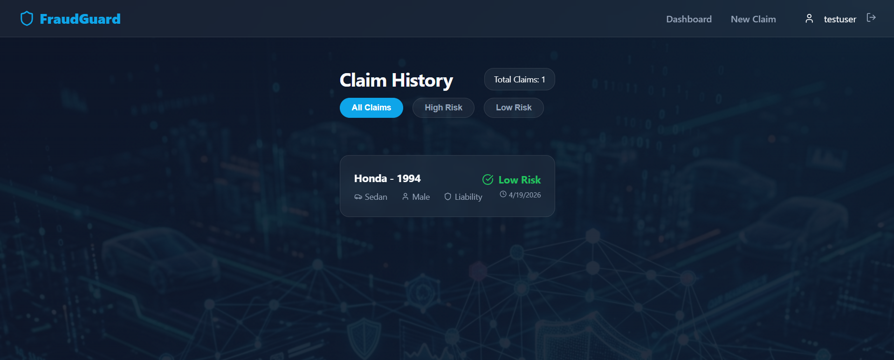
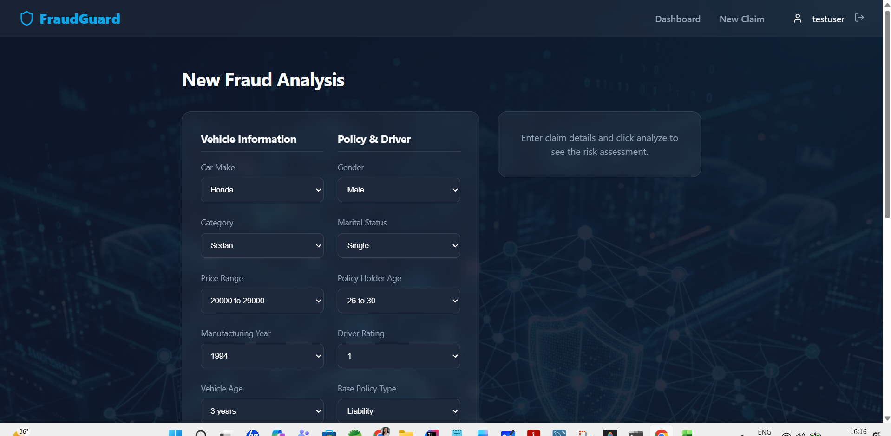
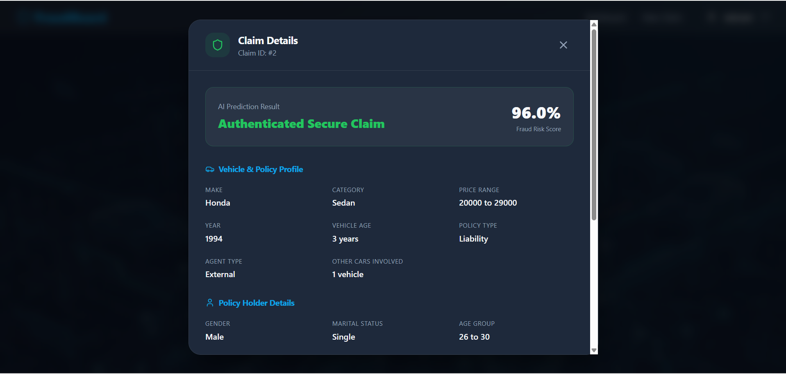

# Vehicle Insurance Fraud Detection System

A full-stack web application designed to detect fraudulent vehicle insurance claims using a machine learning model. The system features a Flask backend, a React frontend, and a MySQL database for managing users and claim history.

## 🖼️ Project Preview

| Dashboard Overview | New Claim Prediction | Claim History Analysis |
| :---: | :---: | :---: |
|  |  |  |

## 🚀 Features

- **Real-time Fraud Prediction**: utilizes a pre-trained Random Forest model to analyze 21 key insurance features.
- **Categorized Dashboard**: Filter claim history by **All**, **High Risk**, or **Low Risk** categories.
- **Detailed Modal View**: Click any claim to view all 21 key data points and incident specifics.
- **User Authentication**: Secure registration and login system with JWT-based protection.
- **Modern UI/UX**: Premium glassmorphic dark-mode aesthetic with interactive forms and visual indicators.
- **Intuitive Risk Scoring**: Provides a **Fraud Risk Score** percentage (0-100%) for every assessment.

## 🛠️ Tech Stack

- **Frontend**: React.js (Vite), Axios, Lucide-React, Vanilla CSS (Premium styling).
- **Backend**: Flask (Python), Scikit-learn, Pandas, Joblib, JWT.
- **Database**: MySQL.
- **Machine Learning**: RandomForestClassifier trained on the Insurance Fraud dataset.

## 📋 Prerequisites

- **Python 3.10+**
- **MySQL Server**
- **Virtual Environment** (recommended for Python)

## ⚙️ Installation & Setup

### 1. Database Setup
1. Log into your MySQL console:
   ```bash
   mysql -u root -p
   ```
2. Run the initialization script provided in the `database` folder:
   ```sql
   source database/init.sql
   ```
   *Note: This creates the `vehicle_fraud_db` database and necessary tables.*

### 2. Backend Setup
1. Navigate to the `backend` directory:
   ```bash
   cd backend
   ```
2. Create and activate a virtual environment:
   ```bash
   python -m venv env
   # Windows:
   .\env\Scripts\activate
   ```
3. Install dependencies:
   ```bash
   pip install -r requirements.txt
   ```
4. Configure Database:
   Update `db_config.py` with your MySQL credentials if they differ from the defaults.
5. Start the Flask server:
   ```bash
   python app.py
   ```
   *The server will run on `http://localhost:5000`.*

### 3. Frontend Setup
1. Navigate to the `frontend` directory:
   ```bash
   cd frontend
   ```
2. Install dependencies:
   ```bash
   npm install
   ```
3. Start the development server:
   ```bash
   npm run dev
   ```
   *The app will be available at `http://localhost:5173`.*

## 📂 Project Structure

```
fraud-detection/
├── backend/
│   ├── app.py                  # Main API server
│   ├── model_service.py        # ML Model prediction logic
│   ├── db_config.py            # MySQL configuration
│   ├── data/                   # Original dataset for dynamic encoding
│   └── model/                  # Serialized .pkl model file
├── frontend/
│   ├── src/
│   │   ├── components/         # UI Elements (Form, Dashboard, etc.)
│   │   ├── context/            # Authentication Context
│   │   └── assets/             # Images and styles
│   └── package.json
└── database/
    └── init.sql                # SQL schema for deployment
```

## 🧠 Model Information

The system uses 21 features optimized via correlation analysis, including:
- Vehicle Make & Category
- Vehicle Price & Age
- Driver Rating
- Past Number of Claims
- Police Report Status

> [!NOTE]
> **Output Mapping**: The model is trained to output binary values where **0** indicates **No Fraud** (Secure Claim) and **1** indicates **Fraud Detected** (High Risk).
>
> Preprocessing is handled dynamically by re-fitting `LabelEncoder` states onto the original training data structure at server startup to ensure 100% parity with the training environment.

## 🤝 Contributing

Contributions are welcome! Feel free to open an issue or submit a pull request for improvements in model accuracy or UI enhancements.

## 📝 License

This project is licensed under the MIT License.
